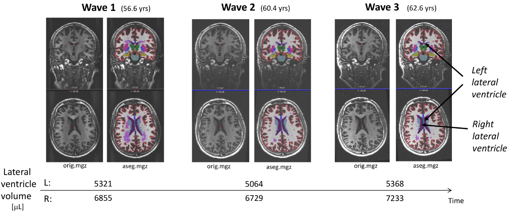

# lvv-ri 

#### (LVV = Lateral Ventricle Volume; RI = Response Inhibition)

## Lateral ventricle volume trajectories predict response inhibition in older age  - A longitudinal brain imaging and machine learning approach

[Astri J Lundervold](https://www.uib.no/personer/Astri.J..Lundervold)(1), Alexandra Vik(1), [Arvid Lundervold](https://www.uib.no/en/persons/Arvid.Lundervold)(2\*) (to appear in PLOS ONE) 
(1) Department of Biological and Medical Psychology University of Bergen, 5009 Bergen, Norway 
(2) [Mohn Medical Imaging and Visualization Centre](https://mmiv.no), Department of Biomedicine, University of Bergen, Norway 
(\*) Corresponding author

**ABSTRACT**

**Objective:** In a three-wave 6 yrs longitudinal study we investigated if the expansion of lateral ventricle (LV) volumes (regarded as a proxy for brain tissue loss) predicts third wave performance on a test of response inhibition (RI). 
**Participants and Methods:**  Trajectories
of left and right lateral ventricle volumes across the three waves were quantified using the longitudinal stream in Freesurfer. All participants (*N=74*;*48* females;mean age *66.0* yrs at the third wave) performed the Color-Word Interference Test (CWIT). Response time on the third condition of CWIT, divided into `fast`, `medium` and `slow`, was used as outcome measure in a machine learning framework. Initially, we performed a linear mixed-effect (LME) analysis to describe subject-specific trajectories of the left and right LV volumes (LVV). These features were input to a multinomial logistic regression classification procedure, predicting individual belongings to one of the three RI classes. To obtain results that might generalize, we evaluated the significance of a *k*-fold cross-validated f1 score with a permutation test, providing a *p*-value that approximates the probability that the score would be obtained by chance. We also calculated a corresponding confusion matrix. 
**Results:** The LME-model showed an annual ~*3.0* % LVV increase. Evaluation of a cross-validated score using *500* permutations gave an f1-score of *0.462* that was above chance level (*p=0.014*). *56* % of the fast performers were successfully classified. All these were females, and typically older than *65* yrs at inclusion. For the true slow performers, those being correctly classified had higher LVVs than those being misclassified, and their ages at inclusion were also higher. 
**Conclusion:** Major contributions
were: (i) a longitudinal design, (ii) advanced brain imaging and segmentation procedures with longitudinal data analysis, and (iii) a data driven machine learning approach including cross-validation and permutation testing to predict behaviour, solely from the individual's brain ``signatures” (LVV trajectories).

